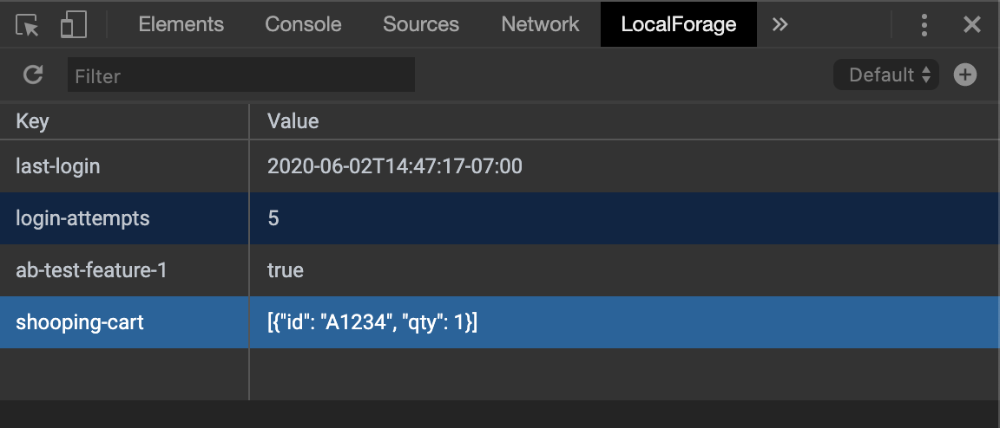

# LocalForage Explorer Chrome Extension
A chrome extension for viewing/editing [localforage](https://github.com/localForage/localForage) data stores in the devtools.



## General Usage

To open the panel:

* Load a website which uses localforage.
* Open the developer tools: View > Developer > Developer Tools.
* Select the LocalForage toolbar

This panel will show you any localforage data stored on this site in the default storage instance (read about other instance, below).

**Add**

To add a new item, double click on the last empty row, enter a key and then press `<enter>` or `<tab>` to add a value.

**Edit**

To edit an existing row, double click on either the key or value to edit it.

**Delete**

Remove a localforage entry by selecting the row and pressing `<delete>` or `<backspace>` on your keyboard.

## Multiple Instances
LocalForage supports [multiple storage instances](https://localforage.github.io/localForage/#multiple-instances). Unfortunately, it does not have a registry of these instances so you need to tell the LocalForage Explorer about them.

To attach to a new or existing instance click the plus (`+`) button in the upper-right corner of the panel and enter a name.

If you're already attached an instance in the explorer, you should be able to select it from the drop down in the upper-right corder of the panel.

## Contribute

If you want to test this locally and provide PRs back to the project, the process is very simple.

### Setup

```bash
npm install
```

### General Development

The easiest way to develop on this is with the local parceljs server.

```bash
npm start
```

This will launch a development server at http://localhost:1234. When using that, it'll be writing to the browser stores on that page.

### Extension Testing

When you're ready to test this as an extension in the browser:

```bash
npm run build
```

Then:
* Go to the chrome extension page: chrome://extensions/
* Select "Developer mode"
* Click "Load unpacked"
* Navigate to the `dist` directory and click "Select".

Now the extension will be loaded into chrome.

*Pro Tip*

Running the following will automatically recompile changes and you'll only need to install it once:

```bash
npm run watch
```
